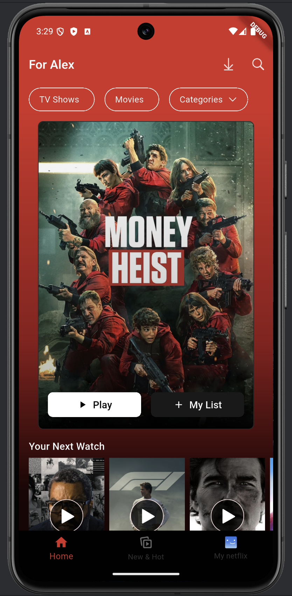
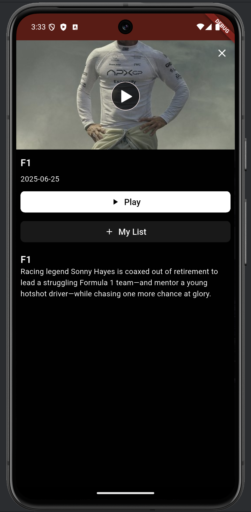
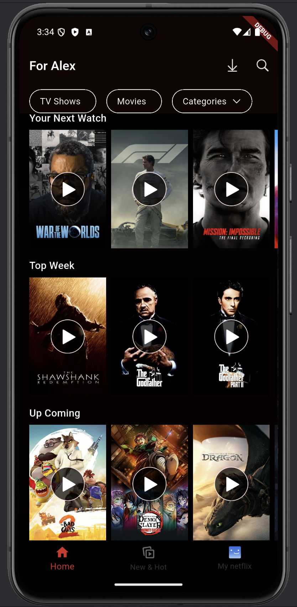

# OMDbApp 🎬

A Flutter application that mocks Netflix's UI design while showcasing clean architecture principles, comprehensive testing, and modern development practices using The Movie Database (TMDB) API.

> **Note**: This project demonstrates modern Flutter development practices including clean architecture, comprehensive testing strategies, and API integration patterns.

## 🏗️ Architecture

This project follows **Clean Architecture** principles with a clear separation of concerns:

```
lib/
├── core/                   # Core utilities and shared resources
│   ├── constants/
│   ├── error/
│   ├── network/
│   ├── usecases/
│   └── utils/
├── features/              # Feature modules
│   ├── home/
│   │   ├── data/         # Data layer (repositories, datasources, models)
│   │   ├── domain/       # Domain layer (entities, repositories, usecases)
│   │   └── presentation/ # Presentation layer (pages, widgets, bloc/cubit)
│   └── account/
└── main.dart
```

### Architecture Layers

- **Presentation Layer**: UI components, state management (Cubit)
- **Domain Layer**: Business logic, entities, repository contracts
- **Data Layer**: API calls, local storage

## 🛠️ Tech Stack

- **Flutter**: Cross-platform mobile framework
- **Bloc/Cubit**: State management
- **Get It**: Dependency injection
- **Dio**: HTTP client for API calls
- **Dartz**: Functional programming (Either type for error handling)

## 🧪 Testing

The project includes comprehensive testing coverage:

### Unit Tests
- Repository implementations
- Use cases business logic
- Bloc/Cubit state management
- Utility functions and helpers

### Widget Tests
- Individual widget components
- Page layouts and interactions
- State-dependent UI changes

### Integration Tests
- End-to-end user flows


## 🚀 Getting Started

### Prerequisites

- Flutter SDK (>=3.0.0)
- Dart SDK (>=2.19.0)
- Android Studio / VS Code
- TMDB API Key

### Installation

1. **Clone the repository**
   ```bash
   git clone https://github.com/yanuarnv/omdbapp.git
   cd omdbapp
   ```

2. **Install dependencies**
   ```bash
   flutter pub get
   ```

3. **Set up TMDB API**
    - Get your API key from [TMDB](https://www.themoviedb.org/settings/api)
    - Create `lib/core/constants/api_constants.dart`:
   ```dart
   class ApiConstants {
     static const String apiKey = 'YOUR_TMDB_API_KEY';
     static const String baseUrl = 'https://api.themoviedb.org/3';
     static const String imageBaseUrl = 'https://image.tmdb.org/t/p/w500';
   }
   ```

4. **Run the app**
   ```bash
   flutter run
   ```

## 📱 Screenshots

| Home  |  Details | Home Scroll |
|-------------|---------------|--------|
| |  |  |

## 📄 License

This project is licensed under the MIT License - see the [LICENSE](LICENSE) file for details.

## 🙏 Acknowledgments

- [TMDB](https://www.themoviedb.org/) for providing the movie database API
- [Netflix](https://www.netflix.com/) for UI inspiration
- Flutter community for amazing packages and resources

⭐ **Star this repository if you found it helpful!**